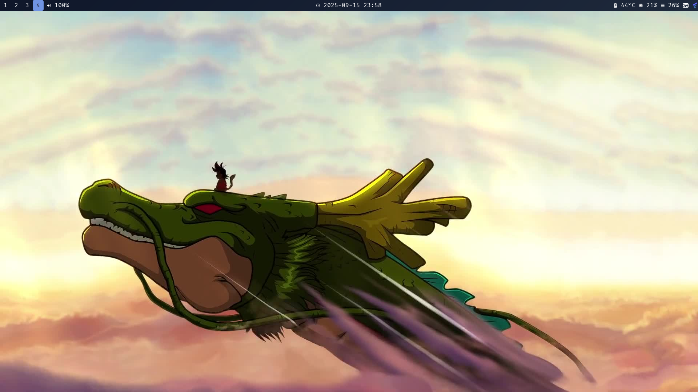

# dotfiles 目录结构与说明

本仓库收录了适用于 Linux（Wayland 环境，主力 Hyprland）的常用配置文件，助你快速搭建美观高效的桌面环境。

## 目录结构

```
.
├── fontconfig/           # 字体渲染与优先级配置
│   └── fonts.conf
├── hypr/                 # Hyprland 相关配置
│   ├── hyprland.conf     # Hyprland 主配置
│   ├── hyprpaper.conf    # 壁纸管理器 hyprpaper 配置
│   └── wallpaper/        # 壁纸文件夹
│       └── goku.jpeg
├── Pictures/             # 截图等图片资源
│   └── screen.png
├── waybar/               # Waybar 状态栏配置
│   ├── config.jsonc
│   └── style.css
└── yazi/                 # Yazi 终端文件管理器配置
    └── yazi.toml
```

---

## 截图预览


