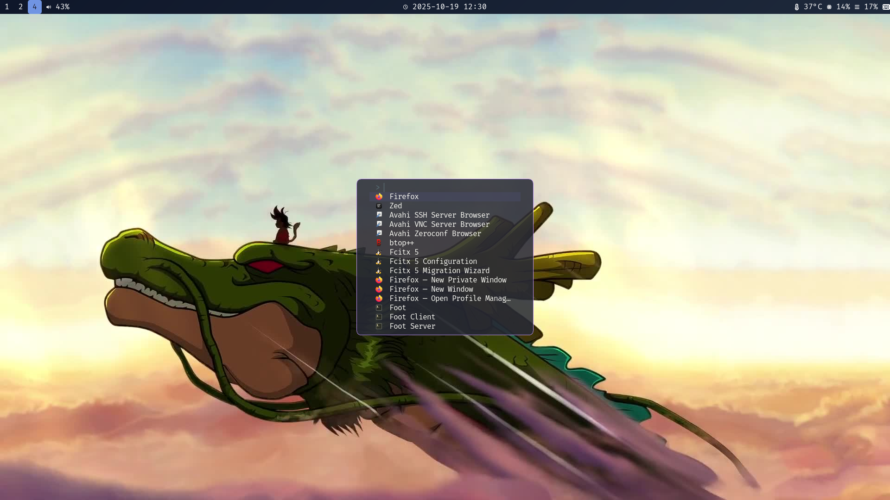

---

## 目录结构

```
.
├── fontconfig
│   └── fonts.conf         # 字体配置
├── foot
│   └── foot.ini           # foot 终端模拟器的配置
├── fuzzel
│   └── fuzzel.ini         # fuzzel 应用起动器配置
├── hypr
│   ├── hyprland.conf      # Hyprland 配置
│   ├── hyprpaper.conf     # Hyprpaper 壁纸管理器配置
│   └── wallpaper
│       └── goku.jpeg      # 壁纸
├── Pictures
│   └── screen.png         # 桌面截图预览
├── README.md              # 项目说明文档
├── waybar
│   ├── config.jsonc       # Waybar 配置
│   └── style.css          # Waybar 样式表
└── yazi
    └── yazi.toml          # Yazi 终端文件管理器配置
```

---


## 依赖说明

- **Hyprland**：现代 Wayland 窗口管理器
- **foot**：轻量级终端模拟器
- **Waybar**：高可定制的状态栏
- **Hyprpaper**：壁纸管理器
- **Yazi**：终端文件管理器
- **fontconfig**：字体配置工具
- **thunar** 文件管理器
- **fuzzel** 应用启动器

请确保已安装上述软件，具体安装方法可参考各自官方文档。

---

## 截图预览




